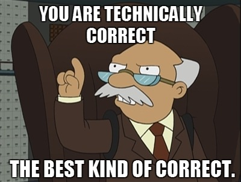

## Learning How to Communicate: Part 2

When I was in high school, I took a technical writing class.  My teacher had us
write a bunch of different pieces of technical writing in fun ways.  One that I
will never forget is, to make a structure that will hold 50 pounds with only a
glue stick, a single 8½" x 11" sheet of paper, and a pair of scissors.  The
challenge was to beat everyone else's and then write a paper on the instructions
on how to build the structure.  At the time, I didn't realize that this taught
me valuable lessons about technical writing being *concise*, *precise*, and
general enough to assume the *reader knows nothing*.

### Being concise
When working at Amazon, a key difference maker about the meetings was to have a
one page document be the center of all meetings. Everyone reads it for the
first half of the meeting, and discusses it during the second half.  "One pager"
was a loose definition, as it was well known that you could attach as many
appendices as wanted.  I once saw a six page document with over 20 pages of
appendices.  As a result, it would take attendees three quarters of the meeting
to read and understand the document and discussions would almost certainly run
over the allotted meeting time.  

Engineers often get lost in making sure they have all the data and forget some
key ideas.  First, appendices are for additional information that is not
necessary for the document.  If it's necessary for the document, it should be
in the document, not attached at the end.  Second, the longer your document
becomes the more you lose interest and attention of the reader.  I'm a big
proponent of using *whitespace* and *bullets* to give a breakup between ideas
and allow the readers to see what's important.  Scanning over a document should
give you the main ideas, and the reasoning can be there as well.

#### tl;dr Be concise
* Shorter documents are easier to not lose readers
* Appendices are for non-essential Information
* Whitespace can be your friend to breakup large ideas

### Being precise
You're in a meeting, and someone calls you out and says "that's not quite correct"
and proceeds to use a slightly more pedantic or specific word to describe the
situation you are talking about.  That person is calling you out for not being
precise with your wording to describe the situation. But, it causes friction
between the person who spoke and the person who is calling them out.  What
separates those with experience and those without, is to talk afterwards and in
a constructive manner to not cause that friction.  How to address other people
will be in a different blog post.  Let's just focus on the writing aspect.

Being precise is something I personally struggle with all the time.  Often, I
try to toe the line between using words that are easy to understand for
non-native English speakers, and using words that more precisely describe the
situation going on.  However, it is important to provide the precision to convey
your point.  

For example, if I said, the traffic will be balanced between multiple
servers versus the traffic will be round-robin load balanced.  The first example
is technically correct, but it doesn't give insight into how it would be load
balanced.  The second example is much more concise and precise on how the traffic
will be balanced.  Which one would you choose?

#### tl;dr Be precise
* Being precise can help your writing have more impact
* Being precise can help your writing be more concise
* Don't be that guy who nitpicks someone's precision in writing, talk to them afterwards about it in a constructive manner

### Assume the reader knows nothing (or less than you think they do)
Engineers struggle with this part of writing.  Excessive jargon and direct
familiarity with their technical domain, often create gaps in knowledge by the
reader.  One can't assume the engineer with 5 years domain experience has the
same knowledge as the VP of engineering, and the junior engineer who just started
the team.  It's important to be inclusive to those in the meeting and have a
document that can stand on its own.

The first step is to start with assuming any acronym is not known by your reader.
At Amazon, acronyms outnumber people.  And with any large ecosystem, only so many
engineers are original at coming up with new names.  Start with always saying
the full name of an acronym along with the abbreviation.  After that point, your
reader knows what the acronym stands for and can remember it for the rest of the
document.  Try to keep the number of acronyms low if possible as it can cause
large amounts of churn of readers looking back to understand what they are reading.

The second step is to give context on what the system does based on your audience.
Are you writing a document to describe a system on top of Elastic Compute Cloud
(EC2), Amazon Web Services' (AWS) cloud computing solution?  If you're talking
to someone who is non-technical, maybe EC2 needs to be defined.  If you're talking
to mostly engineers who use EC2, then maybe it doesn't need to be defined.  But,
always remember to keep documents available by new members of the team, or for
a broader audience, it's better to err on the side of a little more verbose.

The final step is to take a step back from the document, and remember your
audience.  If you've been heads down writing a system for months, you know it
in and out.  You've come up with names of systems and names of tools that perhaps
only a few people know.  Take that step back to broaden your audience a bit and
explain things that readers might need a little help understanding.

#### tl;dr Assume the reader knows nothing
* Define acronyms for the documents, sometimes acronyms have multiple meanings
* Define terms that the audience might not know
* Take a step back and remember your audience knows less than you, you're the expert

### How to balance these?
It's hard to balance these three processes.  They are often at odds with one
another, as to be more concise, maybe you'll lose some precision.  Perhaps, you
might assume the reader knows nothing, and make it much longer than it needs to
be.  It takes time to learn that balance and write a paper that is a balance of
all three.  If you need help with a document before sending it to a larger
audience, find a trusted colleague or friend who knows nothing about your
document to read it.  They can give you feedback to work on.  Remember that
writing is an iterative process.  Practice will help and writing a paper at the
last second will almost certainly not be balanced.
